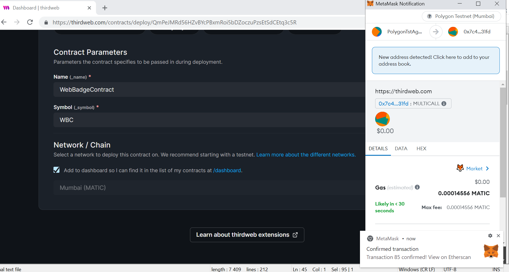

# W3BadgeContract Web3 Application

# Table of contents
1. [Introduction](#introduction)
2. [Architecture](#architecture)
3. [Project Setup](#project-setup)
4. [Configuration](#configuration)
5. [Build and Run the w3badge App](#build-run)
6. [Screenshots](#screenshots)
6. [Resources](#resources)

## Introduction <a name="introduction"></a>
W3BadgeContract is a Web3 application to showcase integration of custom Badge SmartContract on **Thirdweb** Portal SDK **Unity** game with **NFT** storage **IPFS** API  on **Polygon** Blockchain Environment thru **Metamask** wallet.

## Game Logic

- The Player has to move a Ball to hit a Target by Typing Keyboard (Left, Right, Up, Down and Space to Jump) Inputs Clicks and gets one point each time the Target is hit.

- Badge Level 1 is granted to the Player if (s)he reaches 3 points

- Badge Level 2 is granted to the Player if (s)he reaches 10 points
...

Smart Contract Integration :

- At the Beginning of the game session, the Player has to identify with his/her Metamask Wallet.

- On each win (Target hit) action, the Player can decide either to end the session, either to RePlay, either to Synchronize (Store) Data with the Smart Contract.

- Badges represent NFT Player rewards associated to the Smart Contract

## Architecture <a name="architecture"></a>


## Project Setup <a name="project-setup"></a>

To run this project locally, follow these steps.

1. Clone the project locally, change into the directory, and install the dependencies:

```sh
git clone https://github.com/lorcie/w3badge-app.git
```
## Configuration <a name="configuration"></a>

copy the `.env.sample` folder:

```
cp .env.sample .env
```

Customize the .env file with appropriate data about api url, wallet private key for each expected environment (local, test, prod,...)

```
NEXT_PUBLIC_CONTRACT_ADDRESS=
NEXT_PUBLIC_WALLET_ADDRESS=

```
## Build and Run <a name="build-run"></a>

### Contract Deployment on Thirdweb Portal with Polygon Mumbai Test Environment

0. PreRequisites

- on Thirdweb Portal, Create an Account if needed and Access Thirdweb Dashboard  to get your custom Ssmart Contract address

- Add this Smart Contract Address in your Application Code for Unity and Configuration Env File for NextJS Admin Frontend App.


1. ReCompile and Deploy from Scratch the contract by configuring the  to the polygon matic network

```sh
npx thirdweb deploy
```


### Unity Edition and Engine

First Installation : Follow instructions at this Thirdweb link https://blog.thirdweb.com/guides/get-started-with-thirdwebs-unity-sdk/

	- Install Thirdweb Unity SDK if needed by downloading and importing the Unity package and configure as webGL,...
	
	- Change Smart Contract Address parameter value (if new value) in Script SDKManager.cs

Open Unity Editor, select "Start Scene" and click "Build and Run"

You can now play the Unity game by clicking keyboard (Left, Right, Up, Down and Space to Jump) Inputs

### Admin Frontend APP

In main directory w3badge-admin folder

- Run the development Application:

```bash
npm run dev
```
You can then Open [http://localhost:3000](http://localhost:3000) with your browser to see the result.

## Screenshots <a name="screenshots"></a>

W3Badge App Modules>


Unity Game>


Smart Contract>


Thirdweb Custom Smart Contract page>


Thirdweb NFT pages>


Metamask Wallet>


Metamask Wallet Confirmed>




## Resources <a name="resources"></a>

[ipfs nfs storage](https://nft.storage/files/)[https://nft.storage/files/]

[polygon smart contracts / accounts](https://mumbai.polygonscan.com/) [https://mumbai.polygonscan.com/]